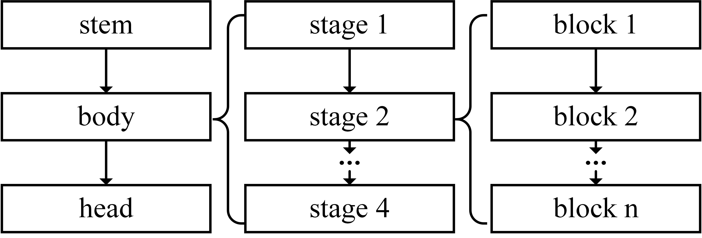

# PerfSeer: An Efficient and Accurate Deep Learning Models Performance Predictor.
## Overview
PerfSeer enables efficient and accurate prediction of various performance metrics for DL models during both training and inference.

We open-sourced the performance metrics dataset used by SeerPerf.  
This dataset spans various styles of network architectures, including GoogLeNet, VGG, ResNe(X)t, MobileNet, and DenseNet, covering a wide range of floating point operations (FLOPs) from 49M to 22T. Additionally, we collect the execution time, GPU memory usage, and GPU Streaming Multiprocessor (SM) utilization for these model configurations during both the training and inference phases on the Nvidia GeForce RTX 3090.

## Dataset Profile
We construct a dataset containing 53k+ model configurations with their various performance metrics to train and evaluate the prediction models of PerfSeer.

### Model Configurations
The CNNs are classic, widely used, and exhibit diverse architectural styles. Therefore, we demonstrate the capability of our predictor by predicting CNN models. We improve upon the NAS method (RegNet) to generate models with various architectures and computational complexities. The general architecture of models in the performance metrics dataset is depicted in the figure below.
<figure style="text-align: center;">
  
  <figcaption>General architecture of CNNs in the dataset.</figcaption>
</figure>

Each model is composed of a stem, body, and head. The stem is a convolutional block comprising a convolution layer, a batch normalization layer, and an activation function. The convolution operation uses a 3×3 kernel, a stride of 2, and produces an output channel of 32. The head consists of a global average pooling layer followed by a fully connected layer.

The body, as the most crucial component of the model, performs the majority of the computational tasks. The body is structured into four stages that gradually reduce the height and width of the input tensor while increasing the number of channels. Each stage consists of a series of similar blocks, with the first or last block using a convolutional layer with a stride of 2 to halve the height and width of the tensor. Therefore, the main focus of our search is on these four stages, and the search space for each stage is defined as follows:

1. **Architecture Style**  
   Each stage randomly selects a network architecture style from various options, including VGG's serial architecture, GoogLeNet's parallel connections, ResNe(X)t's residual connections and group convolution, DenseNet's dense connections, and MobileNet's depth-wise separable convolution.

2. **Depth and Width**  
   The "depth" of a stage represents the number of blocks it includes. Each block typically comprises multiple convolutional blocks, with the specific number and concatenation method determined by the architectural style of the stage. On the other hand, the "width" of a stage indicates the output channels of each block within the entire stage, which is usually determined by either the first or last block.

3. **Specific Configurations**  
   Specific configurations refer to the configurations of each architecture style network, such as the group width for ResNeXt’s group convolution and the growth rate for DenseNet.

Through multiple rounds of random search in the above stage, we acquired a total of 7,202 network architectures.

### Performance Metrics Collection

For input tensors of size `3 x 224 x 224`, we set the batch sizes to 1, 2, 4, 8, 16, 32, 64, 128, and 256. Subsequently, we fed these input tensors into models generated by the search process for both training and inference, collecting diverse performance metrics.

During the metrics collection process, we initiated a 30-second warm-up for models to reach optimal performance for training or inference. Following this, we collected metrics for another 30 seconds. We calculated the execution time per training or inference iteration by recording the number of iterations completed during this period. Additionally, we utilized [pynvml](https://pypi.org/project/pynvml) to obtain the average SM utilization and maximum memory usage.

In total, we collected multiple performance metrics for 53k+ model configurations (batch sizes and network architectures) during both training and inference. Some network architectures had large parameter sizes, causing Out-of-Memory errors with larger batch sizes, which led to incomplete metrics collection. As shown in the table below, our proposed dataset covers a wide range of model configuration variants, encompassing various FLOPs, MAC, parameter sizes, execution time, memory usage, and SM utilization.

| Statistics | FLOPs (G) | MAC (GBytes) | Params (M) | Training Util (%) | Training Mem (MBytes) | Training Time (ms) | Inference Util (%) | Inference Mem (MBytes) | Inference Time (ms) |
|------------|-----------|--------------|------------|-------------------|-----------------------|--------------------|---------------------|------------------------|---------------------|
| **Mean**   | 214.8     | 7.7          | 9.5        | 62.4              | 5,255                 | 87.1               | 72.9                | 2,412                  | 23.8                |
| **Min**    | 0.05      | 0.01         | 0.04       | 5.0               | 1,500                 | 2.9                | 8.0                 | 1,410                  | 0.8                 |
| **Median** | 40.8      | 2.1          | 3.6        | 66.9              | 2,728                 | 44.1               | 97.0                | 1,790                  | 9.2                 |
| **Max**    | 22,543.9  | 70.2         | 254.9      | 99.0              | 24,244                | 1,919.5            | 99.0                | 19,462                 | 554.5               |


## Download the dataset 
Download and unpack our dataset from the [public google drive folder](https://drive.google.com/drive/folders/15anTR-bBTTfvXx9aQXp1BlMcqXjJsmmW?usp=sharing)

## Using the dataset
Example usage(see [example.py](util_dataset/example.py) for a full runnable example)
- parse graph
```python
import networkx as nx
import pickle
import types

from features_define import Feature, Args, MemoryInfo

# load file
cg_path = "test.pkl"
with open(cg_path, "rb") as f:
    compute_graph = nx.DiGraph(pickle.load(f))

# 1.1 parse the node features of the graph
for node_idx in compute_graph.nodes():
    # get node features
    node_feature: Feature = types.SimpleNamespace(
        **compute_graph.nodes[node_idx]["feature"]
    )

    # node type
    type = node_feature.type

    # node args
    args: Args = types.SimpleNamespace(**node_feature.args)
    kernel_size = args.conv_kernel_size

    # node memory information
    mem_info: MemoryInfo = types.SimpleNamespace(**node_feature.memory_info)
    batch_size = mem_info.batch_size
    weight_size = mem_info.weight_size

# 1.2 parse the node features of the graph, using edge information,
# you can derive the connectivity between all nodes in the entire graph.
edges = compute_graph.edges()
```
- parse label
```python
label_path = "test.txt"
with open(label_path, "r") as f:
    label_dict = eval(f.read())
    train_label = label_dict["train"]
    infer_label = label_dict["infer"]
    # get metric label
    (
        time,
        average_sm_util,
        average_memory_util,
        average_memory_usuage,
        peak_sm_util,
        peak_memory_util,
        peak_memory_usuage,
    ) = train_label.split("|")
```
